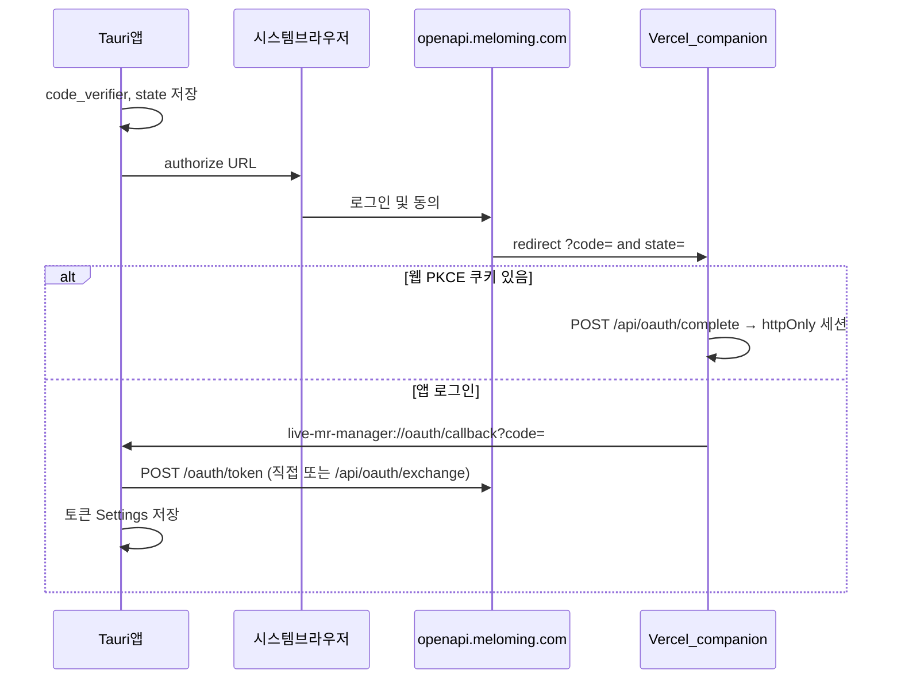
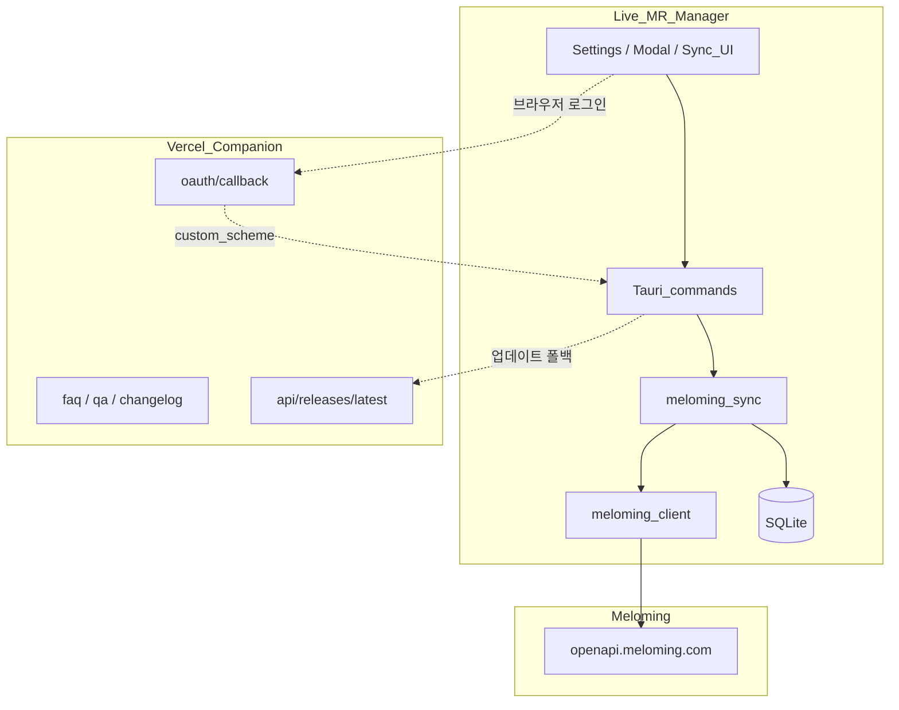
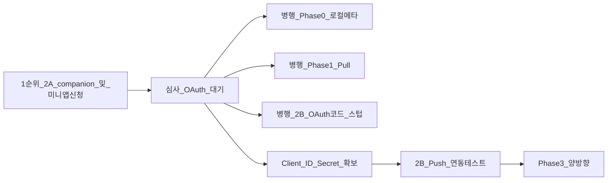

# 멜로밍 노래책 연동 — 상세 기획

| 항목 | 내용 |
|------|------|
| 문서 버전 | 1.0 (2026-06-02) |
| 대상 앱 | Live MR Manager (Tauri 2.x) |
| 관련 이슈 | [ToDo.md §7](../ToDo.md), [README 로드맵](../README.md) |
| 공식 API | [채널 노래책 API](https://developers.meloming.com/docs/openapi/reference/songbook) |
| Base URL | `https://openapi.meloming.com` |
| API 버전 헤더 | `Meloming-Version: 2026-01-11` (미지정 시 최신) |

---

## 1. 배경 및 목표

### 1.1 목표

[멜로밍 채널 노래책 API](https://developers.meloming.com/docs/openapi/reference/songbook)와 앱 **로컬 라이브러리**를 **양방향 메타데이터 동기화**하여, 다음을 하나의 워크플로우로 맞춘다.

- 방송·연습: Live MR Manager에서 MR 재생·AI 분리·가사 동기화
- 플랫폼 노출: 멜로밍 노래책(시청자용 목록·검색·숙련도/난이도 등)

### 1.2 설계 원칙 (README P1~P3 준수)

| 원칙 | 연동 적용 |
|------|-----------|
| **P1 법적 안전성** | 음원 파일·AI 분리 결과(`inst.wav`/`vocal.wav`)는 **로컬만**. 멜로밍에는 **메타·URL·가사 텍스트**만 전송 |
| **P2 실시간성** | 동기화는 백그라운드·수동 트리거. 재생 경로에 API 대기 삽입 금지 |
| **P3 퍼포머 중심** | 설정 한곳, Pull/Push 명확, 충돌 시 선택 가능 |

### 1.3 기술 경계

- HTTP·토큰: Rust `reqwest` ([`src-tauri/Cargo.toml`](../src-tauri/Cargo.toml)), Tauri command만 노출
- `client_secret`·Refresh Token: 프론트엔드(JS)에 **노출하지 않음**
- Companion 웹(Vercel): OAuth **브릿지**·FAQ·changelog만. 토큰 교환은 데스크톱

---

## 2. 멜로밍 API 요약

### 2.1 엔드포인트

| 구분 | 메서드 | 인증 | 용도 |
|------|--------|------|------|
| 노래 목록 | `GET /v1/channels/{channelId}/songs` | 없음 | `page`, `limit`(≤100), `search`, `sortBy`, `difficulty`, `proficiency` 등 |
| 노래 상세 | `GET /v1/channels/{channelId}/songs/{songId}` | 없음 | 단건 |
| 노래 추가 | `POST /v1/channels/{channelId}/songs` | OAuth | 로컬 → 원격 생성 |
| 노래 수정 | `PATCH .../songs/{songId}` | OAuth | 필드 단위 |
| 노래 삭제 | `DELETE .../songs/{songId}` | OAuth | 원격 삭제 |
| 통합 검색 | `GET /v1/songs/search` | 없음 | `q`, 전 채널 검색 |
| 채널 카테고리 | `GET /v1/channels/{channelId}/categories` | 없음 | `categoryIds` 매핑 |
| 채널 아티스트 | `GET /v1/channels/{channelId}/artists` | 없음 | `artistId` 매핑 |

참고: [OpenAPI 개요](https://developers.meloming.com/docs/openapi), [인증 가이드](https://developers.meloming.com/docs/openapi/authentication)

### 2.2 노래 생성/수정 필드 (앱 관련)

| 필드 | 타입 | 필수 | 비고 |
|------|------|------|------|
| `title` | string | O (생성) | |
| `artistId` | number | O (생성) | 채널별 아티스트 ID |
| `albumArt` | string | | 썸네일 URL |
| `karaokeUrl` | string | | 노래방 영상 |
| `coverUrl` | string | | 커버 영상 |
| `originalUrl` | string | | 원곡 URL (YouTube `path` 매핑 후보) |
| `difficulty` | number 1–5 | | 난이도 |
| `proficiency` | number 1–5 | | 숙련도 |
| `songKey` | string | | 키 (예: `C#m`) |
| `bpm` | number | | |
| `lyricsLink` | string | | |
| `lyricsText` | string | | 로컬 `.lrc` ↔ 텍스트 변환 |
| `categoryIds` | number[] | | |

### 2.3 Rate Limit ([OpenAPI 개요](https://developers.meloming.com/docs/openapi))

| 티어 | 요청/분 | 월간 |
|------|---------|------|
| Free | 60 | 10,000 |
| Pro | 300 | 100,000 |

응답 헤더: `X-RateLimit-Limit`, `X-RateLimit-Remaining`, `X-RateLimit-Reset`  
동기화 UI에 진행률·지연(배치) 반영.

### 2.4 API 호출 예시 (curl)

```bash
# 채널 노래 목록 (인증 불필요)
curl -s "https://openapi.meloming.com/v1/channels/CHANNEL_ID/songs?limit=20&sortBy=newest" \
  -H "Meloming-Version: 2026-01-11"

# 검색 + 숙련도 필터
curl -s "https://openapi.meloming.com/v1/channels/CHANNEL_ID/songs?search=봄날&proficiency=4&limit=20"

# 통합 검색
curl -s "https://openapi.meloming.com/v1/songs/search?q=봄날&limit=20"

# 카테고리 / 아티스트
curl -s "https://openapi.meloming.com/v1/channels/CHANNEL_ID/categories"
curl -s "https://openapi.meloming.com/v1/channels/CHANNEL_ID/artists"

# 노래 추가 (OAuth 필요)
curl -X POST "https://openapi.meloming.com/v1/channels/CHANNEL_ID/songs" \
  -H "Authorization: Bearer ACCESS_TOKEN" \
  -H "Content-Type: application/json" \
  -H "Meloming-Version: 2026-01-11" \
  -d '{"title":"노래 제목","artistId":1,"difficulty":3,"proficiency":4,"songKey":"Am","bpm":120}'
```

---

## 3. 현재 앱 상태 (갭 분석)

### 3.1 데이터 모델

[`SongMetadata`](../src-tauri/src/types.rs) / SQLite `Tracks`에 **없음**:

- `difficulty`, `proficiency` (1–5)
- `songKey`, `bpm` — **UI만 존재, DB 미저장** (재시작 시 유실)
- `melomingSongId`, `melomingChannelId`, `melomingArtistId`
- `karaokeUrl`, `coverUrl`, `originalUrl`, `lyricsLink`
- `syncStatus`, `localUpdatedAt`, `remoteUpdatedAt`, `contentHash`

### 3.2 KEY/BPM 버그 (Phase 0 선행)

| 계층 | 파일 | 상태 |
|------|------|------|
| UI | `src/index.html` (`edit-key`, `edit-bpm`) | 있음 |
| 저장 요청 | `src/js/events/modals.js` | `key`, `bpm` 전송 |
| Rust 타입 | `src-tauri/src/types.rs` | 필드 없음 |
| DB | `src-tauri/src/state.rs`, `library.rs` | 컬럼·INSERT 없음 |

### 3.3 모델 불일치

| Live MR Manager | 멜로밍 |
|-----------------|--------|
| `artist` (문자열) | `artistId` (숫자) |
| `categories` / `curationCategory` | `categoryIds[]` |

→ `Meloming_Artist_Map`, `Meloming_Category_Map` 보조 테이블 필요.

### 3.4 코드베이스

`meloming` 모듈 **0건** — 신규 추가.

---

## 4. 로컬 DB 확장안

[`state.rs`](../src-tauri/src/state.rs) 기존 `ALTER TABLE Tracks ADD COLUMN` 패턴 사용.

### 4.1 `Tracks` 추가 컬럼

```sql
song_key TEXT,
bpm INTEGER,
difficulty INTEGER,           -- 1-5, NULL 허용
proficiency INTEGER,
karaoke_url TEXT,
cover_url TEXT,
original_url TEXT,
lyrics_link TEXT,
meloming_song_id INTEGER,
meloming_channel_id INTEGER,
meloming_artist_id INTEGER,
sync_status TEXT DEFAULT 'none',  -- none | synced | pending | conflict
local_updated_at INTEGER,
remote_updated_at INTEGER,
content_hash TEXT
```

### 4.2 보조 테이블

```sql
CREATE TABLE IF NOT EXISTS Meloming_Artist_Map (
  local_name TEXT NOT NULL,
  meloming_artist_id INTEGER NOT NULL,
  channel_id INTEGER NOT NULL,
  PRIMARY KEY (local_name, channel_id)
);

CREATE TABLE IF NOT EXISTS Meloming_Category_Map (
  local_name TEXT NOT NULL,
  meloming_category_id INTEGER NOT NULL,
  channel_id INTEGER NOT NULL,
  PRIMARY KEY (local_name, channel_id)
);
```

### 4.3 Settings 키 (예시)

| key | 용도 |
|-----|------|
| `meloming_channel_id` | 동기화 대상 채널 |
| `meloming_oauth_*` | 토큰은 OS keyring 우선 검토 |
| `meloming_conflict_policy` | `newer_wins` 등 |

`SongMetadata`에 동일 필드를 `camelCase`로 추가.

---

## 5. 필드 매핑

| 멜로밍 | Live MR Manager | 동기화 방향 |
|--------|-----------------|-------------|
| `title` | `title` | ↔ |
| `artistId` | `melomingArtistId` + `artist` | ↔ (이름은 artists API) |
| `albumArt` | `thumbnail` | ↔ |
| `originalUrl` | `path` if YouTube URL | → Push 시 |
| `karaokeUrl` / `coverUrl` | 신규 컬럼 | ↔ (수동·UI 확장) |
| `songKey` | `songKey` | ↔ |
| `bpm` | `bpm` | ↔ (`analyze_key_bpm`) |
| `difficulty` | `difficulty` | ↔ |
| `proficiency` | `proficiency` | ↔ |
| `lyricsText` / `lyricsLink` | `.lrc` / `hasLyrics` | ↔ |
| `categoryIds` | `categories` / `curationCategory` | ↔ (Map) |

**로컬 전용 (미전송)**: `pitch`, `tempo`, `volume`, `isMr`, `isSeparated`, MR 캐시 경로, `playCount`

---

## 6. 인증 및 개발자 등록

### 6.1 문서 vs 개발자 센터 (실측)

| 출처 | 내용 |
|------|------|
| [OpenAPI 개요](https://developers.meloming.com/docs/openapi) | 「애플리케이션 등록하기」에서 OAuth 클라이언트 생성 |
| **실제 콘솔** | 해당 링크 → **미니앱 등록** 페이지로 이동 (사용자 확인) |

**결론**: 쓰기용 OAuth·API Key는 **미니앱(개발자 앱) 등록·심사** 경로를 전제로 한다. (문서상 이름과 UI 불일치)

### 6.2 인증 요구사항

| 작업 | 인증 |
|------|------|
| `GET /v1/**` (목록·검색·카테고리·아티스트) | **불필요** → Phase 1 즉시 가능 |
| `POST` / `PATCH` / `DELETE` (노래책) | **OAuth Access Token** 필수 |
| API Key (`mlm_live_…`) | 쿼터·식별. **채널 쓰기 대체 불가** |

### 6.3 채택 전략

| 경로 | 설명 | 채택 |
|------|------|------|
| **A** | 미니앱 등록·심사 → OAuth → Tauri PKCE | **기본** |
| **B** | 멜로밍 문의: 데스크톱 전용 OAuth 분리 발급 | 병행 |
| **C** | 읽기만 + 쓰기는 멜로밍 웹 수동 / `pending_push` | 심사 지연 시 |

### 6.4 OAuth (Phase 2B)

| 항목 | 값 |
|------|-----|
| Grant | `authorization_code` + **PKCE** (`S256`) |
| Scope | `read write` (동의 화면) |
| Access Token | 1시간 |
| Refresh Token | 7일 |
| Token URL | `POST https://openapi.meloming.com/oauth/token` |
| Authorize URL | `https://openapi.meloming.com/oauth/authorize?...` |

`client_credentials`는 문서 예시가 `scope=read` 위주 — **쓰기 미채택**.

### 6.5 OAuth 등록 체크리스트

- [ ] [멜로밍 개발자 센터](https://developers.meloming.com) 로그인
- [ ] 미니앱(앱) 등록 — 앱명·설명·HTTPS URL
- [ ] 연동 방식: **iframe** → Vercel companion URL ([연동 방식](https://developers.meloming.com/docs/mini-apps/integration))
- [ ] Redirect URI: `https://{companion-domain}/oauth/callback`
- [ ] (폴백) `http://127.0.0.1:{port}/oauth/callback` 허용 여부 확인
- [ ] Client ID / Client Secret / API Key 발급·안전 보관
- [ ] 심사: MR↔노래책 동기화·Q&A 유틸리티 ([필수 요구사항](https://developers.meloming.com/docs/mini-apps/requirements))
- [ ] (병행) 데스크톱 전용 OAuth 분리 가능 여부 문의

### 6.6 OAuth 콜백 흐름 (PKCE)



- Companion `/oauth/callback`: `code`·`state` 파싱 → **웹 PKCE 세션** 또는 **커스텀 스킴**으로 분기
- **토큰 교환**: Tauri에서 `MELOMING_USE_COMPANION_EXCHANGE=true` 시 `POST https://lmrm.vercel.app/api/oauth/exchange` (Client Secret은 Vercel env)
- Redirect URI (등록·코드 공통): `https://lmrm.vercel.app/oauth/callback`

### 6.7 OAuth 실연동 상태 (2026-06-09)

| 단계 | 상태 |
|------|------|
| authorize · code · deep-link | ✅ 동작 |
| `POST /oauth/token` | ❌ 500 INTERNAL_ERROR 또는 401 Invalid redirect_uri (멜로밍 측 확인 중) |
| 앱 UI | 「멜로밍 로그인」「멜로밍에 보내기」→ **「개발 중입니다.」** (`MELOMING_COMING_SOON`) |
| Pull · 연결 테스트 · 채널 저장 | ✅ OAuth 불필요, 사용 가능 |

### 6.8 플랫폼 채널 주소 (Pull용)

[`resolve.rs`](../src-tauri/src/meloming/resolve.rs)가 입력을 멜로밍 채널 ID로 변환한다.

| 플랫폼 | API | 입력 예 |
|--------|-----|---------|
| 치지직 (CHZZK) | `GET /v1/channels/platforms/CHZZK/{id}` | `https://chzzk.naver.com/…`, 32자 hex ID |
| SOOP (숲) | `GET /v1/channels/platforms/SOOP/{id}` | `https://sooplive.co.kr/station/…` |
| 씨미 (CIME) | `GET /v1/channels/platforms/CIME/{id}` | `https://ci.me/@아이디`, `@아이디` |
| 멜로밍 | `GET /v1/channels/{webPath}` | webPath, `meloming.com/…` |
| 숫자 ID | `GET /v1/channels/{id}` | `12345` |

채널 주소는 **로컬 SQLite Settings**에만 저장. 배포본·신규 설치 시 빈 값.

---

## 7. Vercel Companion (미니앱 · OAuth · 서비스 허브)

**호스팅 결정**: Vercel + Next.js (Q&A·changelog·업데이트 API 확장)

### 7.1 URL 구성

| 경로 | Phase | 용도 |
|------|-------|------|
| `/` | 2A | 연동 안내, 다운로드, 미니앱 iframe |
| `/oauth/callback` | 2A | 멜로밍 Redirect URI (웹·앱 분기) |
| `/login`, `/account` | 2A+ | 웹 OAuth 테스트 (추후 정리 예정) |
| `/faq`, `/qa` | 2A | 동기화·숙련도/난이도 Q&A |
| `/download` | 2A | GitHub Releases 링크 |
| `/privacy` | 2A | 개인정보 처리방침 (앱·웹 통합) |
| `/terms` | 2A | 이용약관 |
| `/changelog` | 4 | 릴리즈 노트 |
| `POST /api/oauth/exchange` | 2B | 앱 토큰 교환 프록시 |
| `GET /api/oauth/login` | 2A+ | 웹 authorize 시작 |
| `POST /api/oauth/complete` | 2A+ | 웹 토큰 교환·세션 |
| `GET /api/auth/session` | 2A+ | 웹 로그인 상태 |
| `GET /api/releases/latest` | 4 | 앱 업데이트 manifest JSON |

**등록 예시**

- iframe: `https://lmrm.vercel.app/`
- Redirect URI: `https://lmrm.vercel.app/oauth/callback`

### 7.2 레포 구조 (권장)

- **별도 레포** `live-mr-companion` (또는 monorepo `web/companion/`)
- 스택: Next.js App Router, TypeScript
- 배포: Vercel Git 연동

### 7.3 업데이트 manifest 스키마 (Phase 4)

[`updater.rs`](../src-tauri/src/updater.rs)는 현재 GitHub Releases만 조회. Companion 보강:

```json
{
  "version": "0.4.14",
  "minSupportedVersion": "0.4.0",
  "releaseUrl": "https://github.com/AutumnColor77/Live-MR-Manager/releases/tag/v0.4.14",
  "changelogUrl": "https://lmrm.vercel.app/changelog#v0.4.14",
  "notes": "유튜브 메타 자동 보강, 멜로밍 Push 안정화, 설정 법적 고지, 버전 0.4.14 …",
  "publishedAt": "2026-06-27T00:00:00Z",
  "critical": false
}
```

| 단계 | 내용 |
|------|------|
| 1차 | `/changelog` 페이지, `release_url`을 changelog로 연결 |
| 2차 | GitHub 실패 시 `/api/releases/latest` 폴백 |
| 3차 | 릴리즈 CI로 manifest 자동 갱신, `critical` 시 모달 |

**원칙**: 설치 파일은 **GitHub Releases** 유지. Companion은 메타·문구만.

---

## 8. 시스템 아키텍처



### 8.1 신규 Rust 모듈

| 파일 | 역할 |
|------|------|
| `src-tauri/src/meloming/mod.rs` | 모듈 루트 |
| `src-tauri/src/meloming/client.rs` | HTTP, 타입, 에러 |
| `src-tauri/src/meloming/sync.rs` | Pull/Push, diff, 충돌 |
| `src-tauri/src/meloming/oauth.rs` | PKCE, 토큰 갱신, companion exchange |
| `src-tauri/src/meloming/resolve.rs` | CHZZK/SOOP/CIME/webPath 채널 해석 |
| `src-tauri/src/lib.rs` | command 등록 |

### 8.2 Tauri Commands (예상)

| Command | Phase | 설명 |
|---------|-------|------|
| `meloming_test_connection` | 1 | 채널 ID 유효성 |
| `meloming_pull_songs` | 1 | Pull |
| `meloming_get_artists_categories` | 1 | Map 갱신 |
| `meloming_oauth_start` / `meloming_oauth_finish` | 2B | 로그인 |
| `meloming_push_song` / `meloming_patch_song` | 2B | 쓰기 |
| `meloming_sync_incremental` | 3 | 양방향 |
| `meloming_resolve_conflict` | 3 | 충돌 해결 |

### 8.3 프론트엔드

| 위치 | 변경 |
|------|------|
| settings-page | 방송 채널 주소(치지직·SOOP·씨미), Pull, (로그인·보내기 — 개발 중) |
| 메타데이터 모달 | 숙련도·난이도 1–5, URL 접이식 |
| 라이브러리 / 관리자 | 동기화 상태 배지, 일괄 Pull/Push |
| 컨텍스트 메뉴 | 「멜로밍에 업로드」「가져오기」 |

---

## 9. 양방향 동기화

### 9.1 곡 매칭

1. **최초**: `title` + 정규화 `artist` + (선택) YouTube video ID
2. **확정**: `meloming_song_id` 저장
3. **이후**: ID 기준 PATCH/로컬 업데이트

### 9.2 변경 감지

- 로컬: 저장 시 `local_updated_at`, `content_hash` (동기화 대상 필드만)
- 원격: API 타임스탬프 또는 목록 재조회 해시 비교

### 9.3 충돌 정책 (설정 가능)

| ID | 동작 |
|----|------|
| `newer_wins` | 기본 — 최신 `*_updated_at` 승 |
| `local_wins` | MR·재생 워크플로우 우선 |
| `remote_wins` | 노래책이 소스 오브 트루스 |
| `ask` | 충돌 목록 UI에서 필드별 선택 |

**삭제**: 한쪽만 삭제 → 반대쪽 「고아」표시, **자동 삭제 전파 없음** (사용자 확인).

### 9.4 작업 유형

| 작업 | 설명 |
|------|------|
| Full Pull | `limit=100` 페이지 루프 |
| Full Push | `meloming_song_id IS NULL` → POST |
| Incremental | `pending` / `conflict`만 PATCH |
| Search enrich | `GET /v1/songs/search` (읽기) |

### 9.5 아티스트·카테고리

1. Pull 시 artists/categories API → Map 테이블 갱신
2. Push 시 로컬 이름 → Map → ID; 없으면 **선택 UI** 또는 멜로밍 웹 선등록 안내
3. 미매핑 카테고리: 경고 후 `categoryIds: []` 또는 스킵

---

## 10. UI/UX — 숙련도·난이도

- 스케일: **1–5 정수** (멜로밍과 동일)
- 메타데이터 모달: `edit-difficulty`, `edit-proficiency` (`edit-key` / `edit-bpm` 옆)
- UI 패턴: 기존 장르 Custom Select 또는 5단계 별
- NULL = 미설정 → Push 시 필드 생략
- (Phase 2+) 그리드 배지 `D3` / `P4`, 로컬 필터

### 사용자-facing 문구

- 섹션 제목: **멜로밍 노래책 연동 (OpenAPI)**
- 쓰기 비활성: 「노래 추가·수정은 개발자 등록(미니앱) 및 로그인 후 사용할 수 있습니다. 지금은 **가져오기(읽기)**만 가능합니다.」

---

## 11. 구현 로드맵

### 11.1 실행 순서 (권장) — **Companion·인증 신청을 먼저**

미니앱 등록·심사는 **플랫폼 대기 시간**이 길 수 있으므로, **Vercel companion을 최우선**으로 배포·신청한 뒤, 심사·OAuth 발급을 기다리는 동안 데스크톱 쪽을 병행 개발한다.



| 순서 | Phase | 블로킹 | 할 일 |
|------|-------|--------|--------|
| **1** | **2A** | 없음 | Vercel companion (`/`, `/oauth/callback`, FAQ/Q&A 골격) 배포 → **미니앱 등록·심사 제출** |
| **2 (병행)** | 0 | 없음 | KEY/BPM·숙련도·난이도 DB/UI (멜로밍 필드 기반) |
| **2 (병행)** | 1 | 없음 | `meloming_client`, Pull, Map — **OAuth 없이** 즉시 가능 |
| **2 (병행)** | 2B 준비 | 테스트만 블로킹 | PKCE·토큰 저장·Push API **코드** 작성 (실연동은 2A 완료 후) |
| **3** | 2B 완료 | OAuth | Push·PATCH·DELETE 실연동 (토큰 API 안정화 후) |
| **4** | 3 | | 양방향·충돌 |
| **5** | 4 | | changelog·releases API·업데이트 알림 |

**2A를 먼저 하는 이유**

- 심사·승인·Client ID 발급이 **임계 경로(critical path)** — 늦게 신청하면 전체 일정이 밀림
- companion만으로도 미니앱 iframe·심사 「유용한 가치」 충족 가능 (앱 기능 없이도 제출 가능)
- `/oauth/callback`은 배포만 해 두면 승인 후 바로 Redirect URI로 사용
- 대기 중 **Phase 0·1**으로 사용자 가치(Pull·로컬 메타)는 먼저 제공

### 11.2 Phase별 산출물

| Phase | 기간(추정) | 산출물 |
|-------|------------|--------|
| **2A** | 2–4일 (+심사 대기) | Vercel companion, 미니앱 등록·심사, OAuth 클라이언트 |
| **0** | 1–2일 | KEY/BPM·숙련도·난이도 DB/UI 영속화 |
| **1** | 3–5일 | `meloming_client`, 설정, Pull, Map (무인증) |
| **2B** | 5–7일 | PKCE, POST/PATCH/DELETE, Push (2A 승인 후 검증) |
| **3** | 5–8일 | 양방향, 충돌 UI, 삭제·고아 |
| **4** | 선택 | changelog, releases API, updater 연동, Q&A 본문 |

상세 체크리스트: [ToDo.md §7](../ToDo.md).

---

## 12. 리스크 및 완화

| 리스크 | 완화 |
|--------|------|
| 앱등록 링크 → 미니앱 페이지 | 2A 전제, 경로 B/C |
| OAuth 심사·토큰 500/401 | 2A·멜로밍 지원, UI `MELOMING_COMING_SOON` 잠금 |
| KEY/BPM 미저장 | Phase 0 필수 |
| `artistId` 필수 | Map + 선택 UI |
| 아티스트 생성 API 없음 | 멜로밍 웹 선등록 안내 |
| YouTube `path` vs `originalUrl` | YouTube만 `originalUrl` 매핑 |
| Rate limit 60/min | 배치·UI 진행률 |
| 토큰 유출 | Rust only, keyring |
| 미니앱 심사 반려 | companion Q&A·동기화 안내 |
| Redirect URI 폼 제한 | 멜로밍 문의 또는 localhost 폴백 |

---

## 13. 성공 기준 (Acceptance)

- [ ] 숙련도·난이도·KEY·BPM 저장 후 재시작해도 유지
- [ ] OAuth 로그인 후 선택 곡 멜로밍 생성·수정
- [ ] Pull 후 `meloming_song_id`로 재동기화
- [ ] 충돌 표시 및 정책/수동 해결
- [ ] 음원 바이너리 멜로밍 미업로드
- [ ] (Phase 4) changelog·releases API·앱 업데이트 알림

---

## 14. 참고 링크

- [멜로밍 OpenAPI 개요](https://developers.meloming.com/docs/openapi)
- [채널 노래책 API](https://developers.meloming.com/docs/openapi/reference/songbook)
- [인증 가이드](https://developers.meloming.com/docs/openapi/authentication)
- [미니앱 연동 방식](https://developers.meloming.com/docs/mini-apps/integration)
- [미니앱 필수 요구사항](https://developers.meloming.com/docs/mini-apps/requirements)
- [Playground / Swagger](https://developers.meloming.com) (문서 내 링크)

---

*문서 변경 시 README·ToDo §7과 버전/날짜를 맞출 것.*
